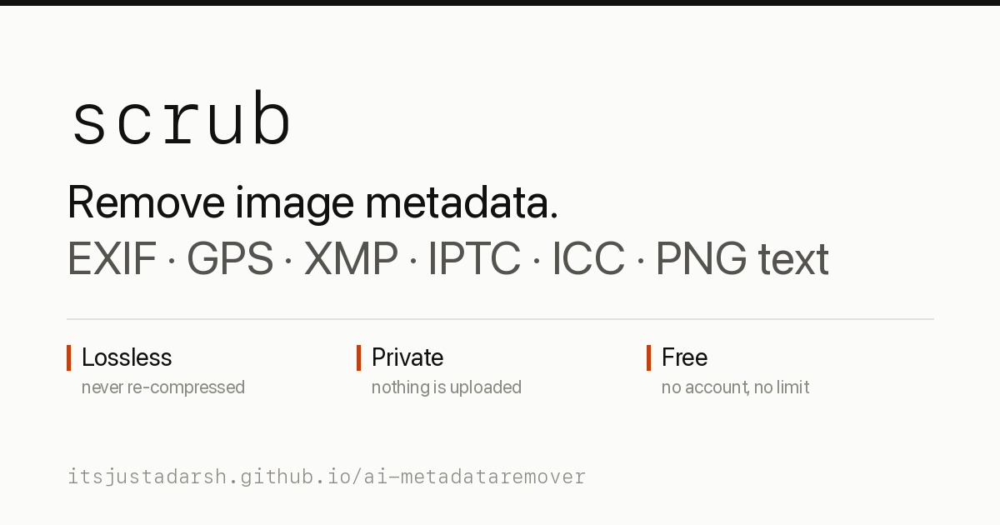

<h1 align="center">Scrub</h1>

<p align="center">
  Strip, forge and alter image metadata — entirely in your browser.<br>
  No uploads. No account. No cost. No dependencies.
</p>

<p align="center">
  <a href="https://itsjustadarsh.github.io/scrub/"><b>Open the tool →</b></a>
</p>

<p align="center">
  
</p>

---

Every photo you take carries a second file inside it. A JPEG off a phone typically holds the
camera make and model, the lens, the exposure settings, the exact second the shutter opened,
the software version, and — unless you turned it off — the GPS coordinates of where you were
standing. PNGs carry text chunks that editors and generators quietly fill with software names,
prompts and timestamps.

Scrub removes all of it, in your browser, without uploading anything.

## What it does

### Strip

Removes every embedded record from JPEG and PNG: EXIF, GPS coordinates, XMP packets,
IPTC/Photoshop blocks, ICC profiles, JPEG comments, PNG `tEXt`/`iTXt`/`zTXt`/`eXIf`/`tIME`
chunks, and any bytes smuggled in after the end-of-image marker.

This is **byte surgery, not re-encoding**. The file's segment structure is walked and the
metadata records are dropped; the entropy-coded scan data (JPEG) and `IDAT` chunks (PNG) are
copied through untouched. Decoded pixels come out **bit-identical** to the original and the
file gets smaller, not worse. Most online EXIF removers redraw your photo onto a canvas and
re-save it, quietly re-compressing it every time.

### Forge

Stripping leaves an obviously blank file. Forge mode writes a complete, internally consistent
EXIF block in its place: camera make, model, lens, software, shutter/aperture/ISO/focal length
(plus the derived APEX `ShutterSpeedValue` and `ApertureValue`), GPS latitude/longitude/altitude
with a matching UTC timestamp, date taken with the right timezone offset, artist and copyright.

Nine presets — iPhone 16 Pro, iPhone 13, Pixel 9 Pro, Canon EOS R5, Sony α7 IV, Nikon Z6 III,
Fujifilm X-T5, Leica Q3 and an Epson film-scan profile — keep the numbers plausible; a phone
preset won't hand you f/1.4 at 200mm. Every field stays editable, and `randomize all` rolls a
coherent shot with a real city coordinate.

### Alter pixels — optional, off by default

Removing metadata doesn't change the image, so two copies still hash identically and still
match under reverse image search. Pixel mode changes that, at three strengths:

| tier | what it does | measured on a photo |
|---|---|---|
| `subtle` | ±1 level of dithered noise, high-quality re-encode | ~0.2% average change, PSNR ≈ 50 dB |
| `medium` | adds a 0.3% rescale and a 2px crop | ~0.5% average change, PSNR ≈ 42 dB |
| `heavy` | adds grain, a tone curve and 0.2° of rotation | ~1.8% average change, PSNR ≈ 33 dB |

A `custom` tier exposes every knob — noise, grain σ, rescale, crop, rotation,
brightness/contrast/saturation, JPEG quality — and a seed, so the same seed reproduces the same
output byte for byte.

**This re-encodes the image**, so it is no longer lossless, and PNG output can grow several
times larger because noise doesn't compress.

Each row then reports what actually happened: average pixel change, share of pixels changed
after re-encode, PSNR, and the Hamming distance between the original and the output under a
difference hash. Expand `inspect` for a drag-to-compare view.

> **On what this does and doesn't defeat.** Changing pixels reliably breaks exact-file matching
> and destroys data hidden in the low bits. It does **not** reliably defeat robust invisible
> watermarking such as SynthID, and it does not defeat AI-image detectors — those are designed
> to survive noise, re-compression, cropping and rescaling. Scrub reports the measured dHash
> distance instead of making a claim; on most images the subtle tier barely moves it, and the
> tool says so rather than hiding it.

## Verify it yourself

Nothing here asks to be trusted.

```sh
exiftool clean.jpg       # only filesystem/derived tags remain
pngcheck -v clean.png    # validates every chunk CRC
```

Or in Python, which also proves the strip was lossless:

```python
from PIL import Image; import hashlib
h = lambda p: hashlib.sha256(Image.open(p).convert("RGB").tobytes()).hexdigest()
assert h("original.jpg") == h("clean.jpg")      # identical pixels
assert not dict(Image.open("clean.jpg").getexif())
```

The repo ships that check as `npm run test:verify`.

## Development

```sh
git clone https://github.com/itsjustadarsh/scrub.git
cd scrub
npm run dev            # http://localhost:8080
```

No install step — there are no dependencies. `src/js/` is a set of plain ES modules the browser
loads directly in development; `npm run build` bundles them into the single self-contained
`index.html` that gets served in production.

```sh
npm run build          # regenerate index.html (commit the result)
npm run check          # fail if index.html is out of date
npm test               # codec + SEO tests, pure Node
npm run test:browser   # pixel engine and the real UI, headless Chrome
npm run test:verify    # independent check with Pillow
```

See **[CONTRIBUTING.md](CONTRIBUTING.md)** for the project map, how to make common changes
(adding a camera preset, a pixel tier, a new metadata format), and the PR checklist.

## Project structure

```
index.html          generated single-file app — what GitHub Pages serves
src/                the actual source: markup, styles, ES modules
build.mjs           dependency-free bundler, ~100 lines
scripts/serve.mjs   dev server
test/               codec, SEO, browser and independent-verification tests
og.png              social card    robots.txt, sitemap.xml   crawling
```

## Deploying

The repo is a static site with the built `index.html` at the root, so GitHub Pages serves it
with no workflow and no configuration: **Settings → Pages → Deploy from a branch → `main` /
`(root)`**. `.nojekyll` stops Pages from processing the files.

Forking it somewhere else? The site URL is baked into `canonical`, `og:url`, `sitemap.xml`,
`robots.txt`, the JSON-LD and the footer link — search for `itsjustadarsh.github.io/scrub` and
replace it, then run `npm run build`.

## Limits

- JPEG and PNG only. HEIC, WebP, TIFF and RAW are not supported.
- Stripping cannot remove information that is *in the pixels* — a timestamp burned into a
  photo, or a payload robust to re-encoding.
- JFIF density (`APP0`) is deliberately kept: it identifies nothing and some decoders want it.
- Progressive JPEG, palette PNG, 16-bit PNG and APNG all survive the lossless path. Pixel mode
  re-encodes through a canvas, which flattens palettes, bit depth and animation.

## License

MIT — see [LICENSE](LICENSE).
